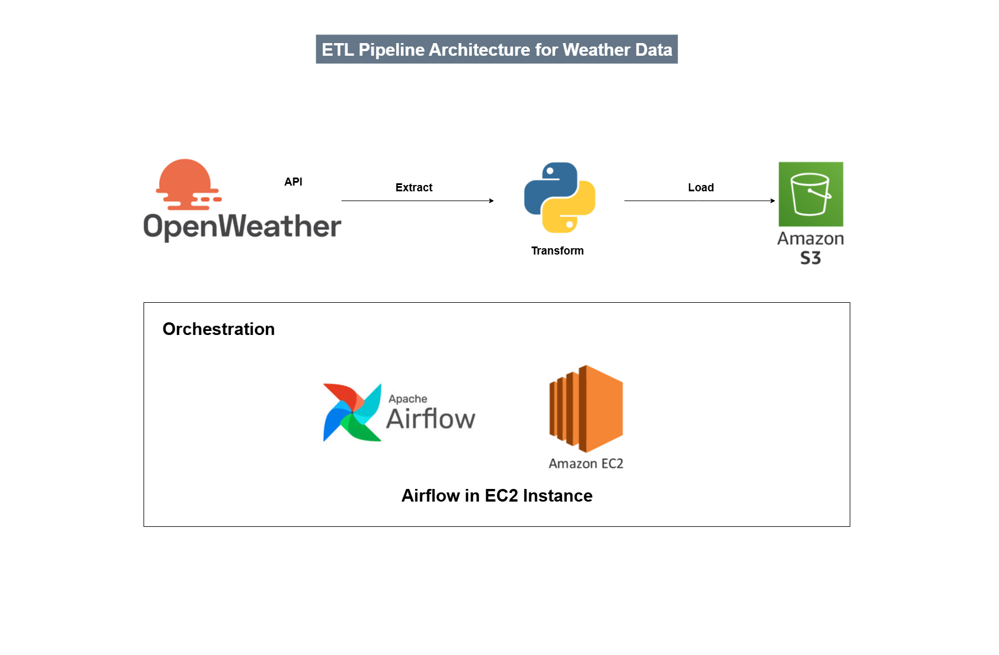

# 🌦️ Weather ETL Pipeline

This project implements a cloud-native ETL (Extract, Transform, Load) pipeline that automates the collection of real-time weather data using the **OpenWeather API**, transforms it with **Python**, and stores it in **Amazon S3** for further analysis.

> The pipeline is orchestrated using **Apache Airflow** deployed on an **AWS EC2** instance.

---

## 📁 Files Included
- `weather_dag.py`: Defines the full ETL DAG including API health check, data extraction, transformation, and loading to S3.
- `etl_architecture.png`: A visual representation of the overall architecture for the ETL pipeline.

---

## ⚙️ Technologies Used
- **Apache Airflow** – for workflow orchestration
- **Python** – for data transformation
- **OpenWeatherMap API** – to fetch real-time weather data
- **Amazon S3** – for scalable storage
- **EC2 (AWS)** – to host and run Airflow

---

## 🔄 Workflow Overview

1. **API Availability Check**: Ensures the OpenWeather API is reachable.
2. **Data Extraction**: Fetches real-time weather data for a selected city (e.g., Karachi).
3. **Data Transformation**: Converts temperature from Kelvin to Celsius and extracts relevant weather metrics.
4. **Data Loading**: Saves the transformed data as a `.csv` file to an Amazon S3 bucket.

---

## 📸 Architecture

---

## 🚀 How to Run

1. Clone the repo.
2. Configure your Airflow `connections` and AWS credentials.
3. Place `weather_dag.py` inside the Airflow `dags/` directory.
4. Start Airflow services and the DAG will run as per schedule (`@daily`).

---

## 🤝 Connect

Project executed by **Muhammad Hamza**  
Feel free to fork, star ⭐, and connect!  
If you have feedback, ideas, or questions—feel free to open an issue or connect with me on [LinkedIn](https://www.linkedin.com/in/-muhammad-hamza/)
